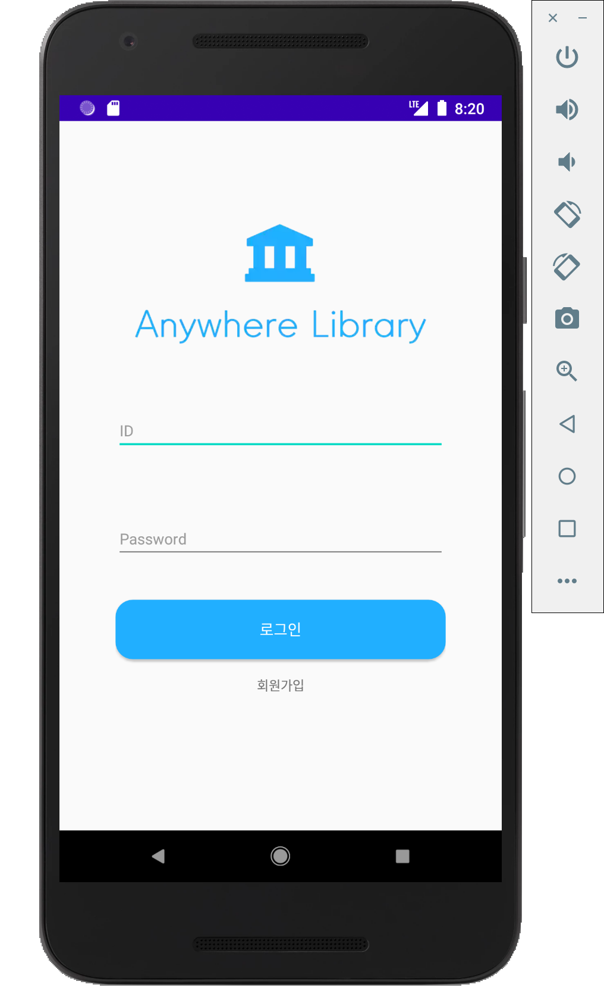
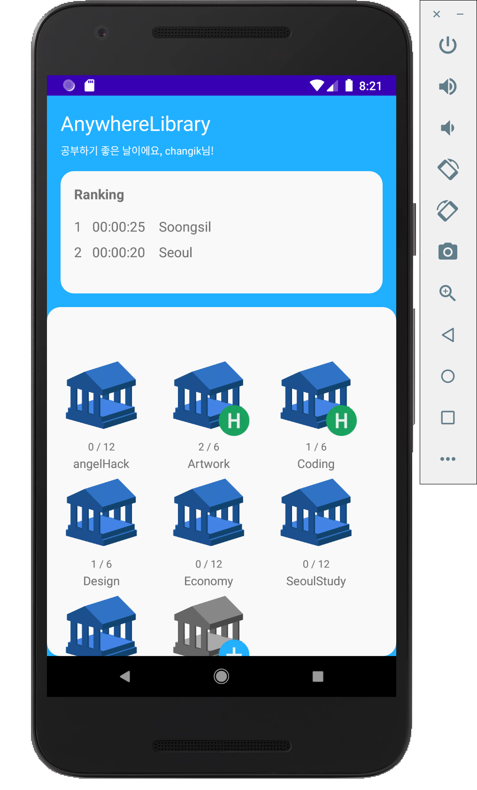
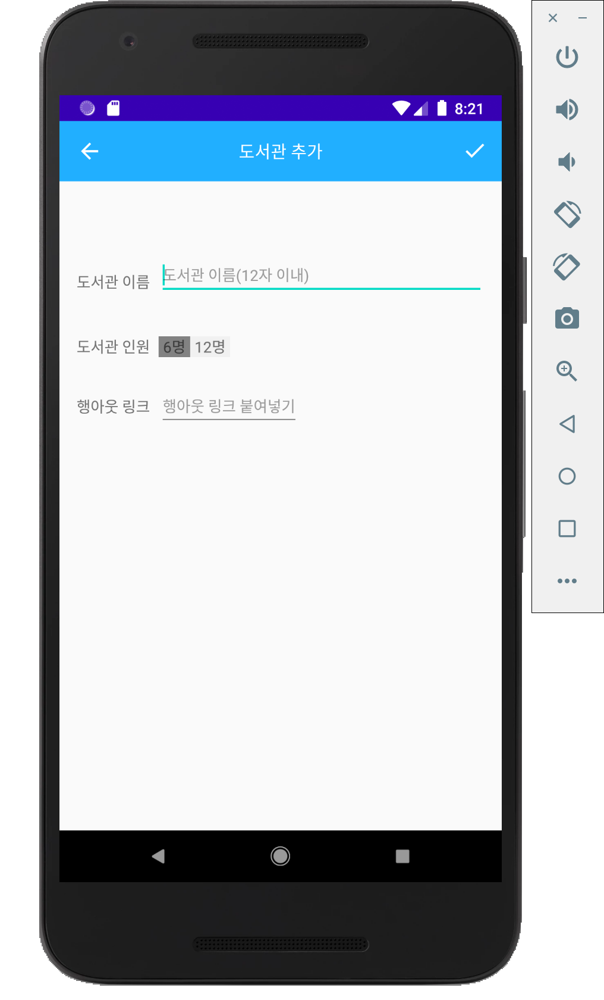
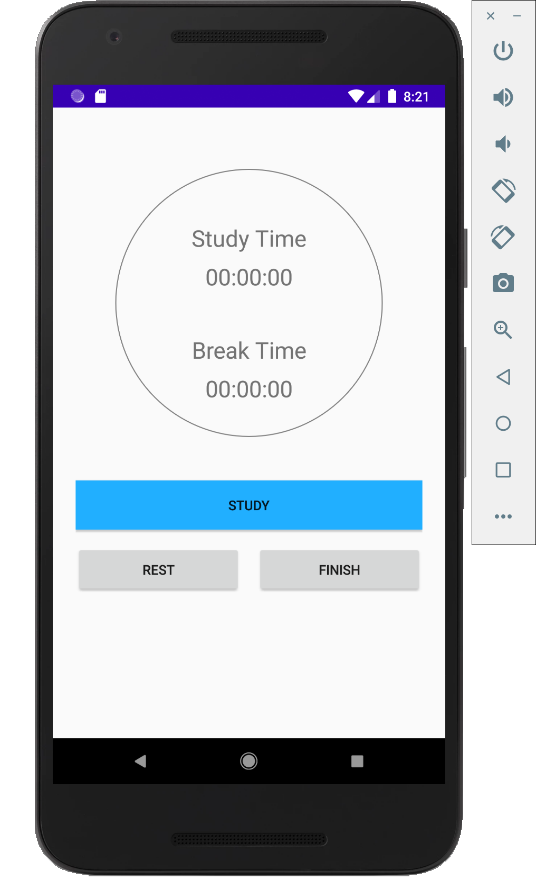

# 📒AnywhereLibrary

## AngelHack2020

### 👍 About

This app is for the 2020 AngelHack hackerton. It is an online study service to improve the learning efficiency of students in preparation for the post corona era. It has the service to study in one room together or to study cams through Google's hangout.

### 🖥 TechStack and Architecture

The program was produced using Kotlin. it also used Jetpack's navigation, Livedata, and MVVM.Retrofit2, RxJava for HTTP communications were used; for MVVM, each screen separated View and ViewModel, and Usecase.

### 🛠 Libraries Used

Data Binding - Declaratively bind observable data to UI elements.

Navigation - Handle everything needed for in-app navigaiton.

SingleLiveEvent - a LiveData that only notify object's state change for View.

ViewModel - Store UI-related data that isn't destroyed on app rotations. Easily schedule asynchronous tasks for optimal execution.

### 📷 Screenshots

